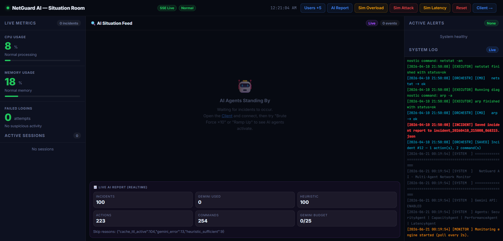
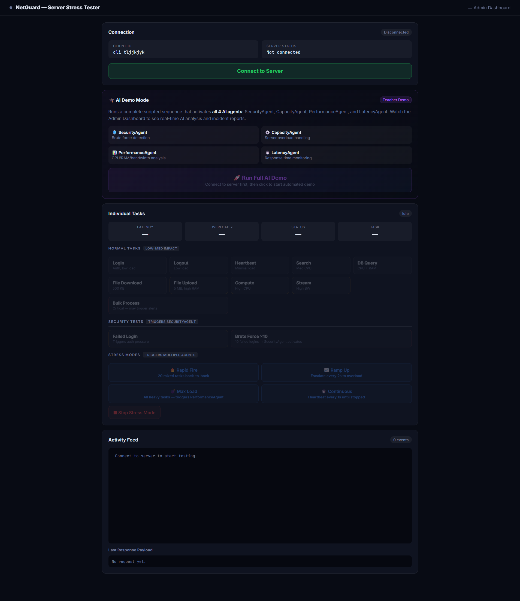
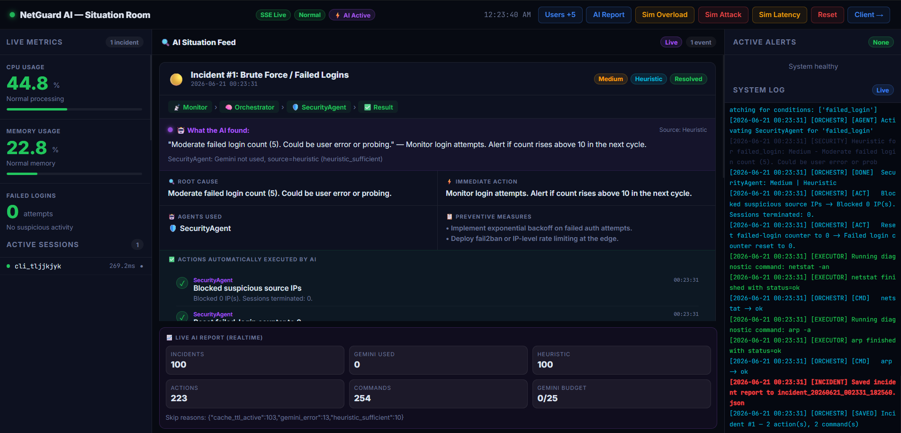
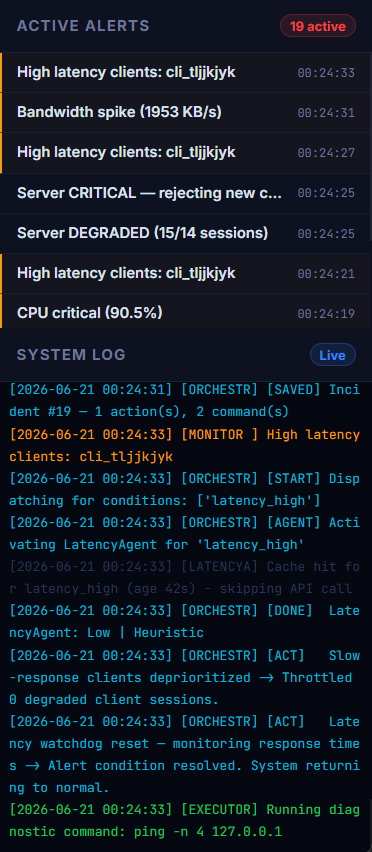

# NetGuard AI – AI-Assisted Automated Network Monitoring & Troubleshooting System


## 🚀 Project Description

**NetGuard AI** is an AI-powered network monitoring and troubleshooting platform that simulates real-world infrastructure monitoring, anomaly detection, incident response, and automated root-cause analysis.

The system continuously monitors server health metrics, detects abnormal network conditions, executes safe diagnostic commands, and leverages **Google Gemini 2.0 Flash** to provide intelligent diagnosis and actionable recommendations through a real-time dashboard.

---

# 🌟 Project Highlights

- 🤖 AI-Assisted Incident Diagnosis using Gemini 2.0 Flash
- 📡 Real-Time Network Monitoring Engine
- ⚡ Automated Alert Detection & Response Pipeline
- 🔄 Recursive AI Investigation Workflow (Up to 3 Iterations)
- 📊 Live Dashboard with Server-Sent Events (SSE)
- 🛡️ Secure Diagnostic Command Execution Engine
- 📈 Capacity Management & Overload Simulation
- 📝 Automated Incident Reporting System
- 🌐 Multi-Client Network Simulation Environment
- 🔍 Root Cause Analysis with Preventive Recommendations

---

# 📖 Overview

Modern infrastructure environments generate large volumes of operational data. Detecting performance bottlenecks, suspicious activity, latency spikes, and capacity issues manually can be time-consuming and error-prone.

NetGuard AI demonstrates how Artificial Intelligence can be integrated into monitoring systems to:

- Detect anomalies automatically
- Investigate incidents intelligently
- Execute diagnostic commands safely
- Generate root cause analysis
- Recommend corrective actions
- Maintain historical incident records

The platform is designed for:

- Students learning Network Monitoring
- AI Engineering Enthusiasts
- Cybersecurity Learners
- System Administrators
- Infrastructure Engineers
- Academic Demonstrations

---

# 🎯 Problem Statement

Traditional monitoring dashboards only display metrics and alerts. Human operators must manually:

1. Investigate the issue
2. Run diagnostic commands
3. Analyze outputs
4. Determine root causes
5. Suggest remediation actions

This process is slow and difficult to scale.

NetGuard AI introduces an AI-driven workflow that automates much of the diagnostic process by combining monitoring, command execution, and large language model reasoning.

---

# 💡 Why This Project Matters

Modern IT operations are moving toward:

- AIOps (Artificial Intelligence for IT Operations)
- Automated Incident Response
- Intelligent Monitoring Systems
- Self-Healing Infrastructure

NetGuard AI demonstrates practical implementation concepts used in:

- Network Operations Centers (NOCs)
- Security Operations Centers (SOCs)
- Cloud Monitoring Platforms
- DevOps Infrastructure
- Enterprise Incident Management Systems

This project bridges the gap between traditional monitoring and AI-assisted operational intelligence.

---

# ✨ Key Features

## Monitoring Engine

- Continuous monitoring every 3 seconds
- Real-time metric collection
- Threshold-based anomaly detection
- Alert cooldown management
- Multi-condition monitoring support

## AI Diagnostic Pipeline

- Gemini 2.0 Flash integration
- Recursive investigation workflow
- Context-aware command selection
- Root cause analysis generation
- Severity assessment
- Preventive recommendations

## Capacity Management

- Three-tier capacity model
- Normal Mode
- Degraded Mode
- Critical Rejection Mode
- Session-based overload simulation

## Command Execution Engine

Safe execution of:

- Ping
- Netstat
- Traceroute
- Nslookup
- IP Configuration
- ARP
- Route
- User Session Inspection

## Incident Management

- Automated incident generation
- JSON incident reports
- Historical incident storage
- Investigation tracking
- Resolution monitoring

## Real-Time Dashboard

- Live system metrics
- Active session monitoring
- Incident timeline
- Capacity gauge
- Live logs
- AI diagnosis visualization

## Network Simulation

Supports simulation of:

- Authentication requests
- Database queries
- File uploads/downloads
- Streaming traffic
- Heavy computation
- Bulk processing
- Heartbeat traffic

---

# 🛠 Technology Stack

## Frontend

- HTML5
- CSS3
- Vanilla JavaScript
- Server-Sent Events (SSE)

## Backend

- Python 3.10+
- Flask 3.x
- Threading
- Subprocess
- Urllib

## Artificial Intelligence

- Google Gemini 2.0 Flash

## Data Storage

- JSON-Based Incident Storage
- Log File Storage

## Networking

- Netstat
- Ping
- Traceroute
- ARP
- DNS Lookup

## Tools & Libraries

- Flask
- Threading
- Queue
- JSON
- Logging Utilities
- Collections (Deque)
- OS Utilities

## Deployment

- Localhost Development Environment
- Cross-Platform Support
  - Windows
  - Linux
  - macOS

---

# 🏗 System Architecture

```text
Clients
   │
   ▼
Flask Server
   │
   ├── State Manager
   │
   ├── Task Simulator
   │
   ├── Monitoring Engine
   │
   ▼
AI Diagnostic Pipeline
   │
   ├── Gemini Analysis
   ├── Command Recommendation
   ├── Command Execution
   └── Root Cause Analysis
   │
   ▼
Incident Management
   │
   ├── Logging System
   ├── Incident Reports
   └── Dashboard Updates
   │
   ▼
Real-Time Admin Dashboard
```

---

# 🔄 Workflow

## Step 1

Client performs operations through the simulator.

## Step 2

Task simulator generates resource consumption and latency metrics.

## Step 3

Monitoring engine continuously evaluates system conditions.

## Step 4

If thresholds are exceeded:

- CPU alerts
- RAM alerts
- Capacity alerts
- Login attack alerts
- Latency alerts
- Bandwidth alerts

are generated.

## Step 5

AI Pipeline is triggered.

## Step 6

Gemini suggests a diagnostic command.

## Step 7

Executor safely runs the command.

## Step 8

Command output is analyzed by Gemini.

## Step 9

Root cause and remediation recommendations are generated.

## Step 10

Incident report is stored and dashboard updates in real-time.

---

# 📦 Major Modules

## app.py

Application entry point.

Responsibilities:

- Route management
- SSE broadcasting
- Dashboard serving
- Monitor startup

---

## state_manager.py

Central state management system.

Tracks:

- Sessions
- CPU usage
- RAM usage
- Requests
- Alerts
- Capacity state

---

## monitor.py

Background monitoring daemon.

Functions:

- Threshold evaluation
- Alert generation
- AI trigger management

---

## ai_engine.py

AI investigation engine.

Functions:

- Gemini communication
- Command recommendation
- Incident analysis
- Recursive investigations

---

## executor.py

Secure command execution layer.

Features:

- Command whitelist
- Timeout protection
- OS-aware execution

---

## task_simulator.py

Network workload simulation module.

Supports:

- Login
- Logout
- Search
- Database Query
- Streaming
- Bulk Processing
- File Operations

---

## logger.py

Logging and incident persistence module.

Stores:

- System logs
- Incident reports
- Historical diagnostics

---

# 👥 User Roles & Permissions

## Administrator

- View dashboard
- View logs
- Monitor incidents
- Trigger simulations
- Reset environment

## Client/User

- Join sessions
- Execute simulated tasks
- Generate traffic patterns
- Trigger operational events

---

# 🗄 Database Design

> This project uses JSON-based storage instead of a traditional database.

## Incident Reports

Stores:

- Alert Context
- Investigation Iterations
- AI Recommendations
- Resolution Status

## System Logs

Stores:

- Monitoring Events
- Client Activity
- AI Activity
- Capacity Events

## Runtime State

Maintains:

- Sessions
- CPU Metrics
- RAM Metrics
- Request Rates
- Latency History

---

# 🔌 API Documentation

## Client APIs

| Method | Endpoint | Purpose |
|----------|------------|------------|
| POST | /api/join | Join Session |
| POST | /api/leave | Leave Session |
| POST | /api/task/login | Authentication Simulation |
| POST | /api/task/<task_name> | Execute Task |

---

## Monitoring APIs

| Method | Endpoint | Purpose |
|----------|------------|------------|
| GET | /api/state | Current State |
| GET | /api/logs | System Logs |
| GET | /api/incidents | Incident History |
| GET | /api/events | SSE Stream |

---

## Simulation APIs

| Method | Endpoint | Purpose |
|----------|------------|------------|
| POST | /api/simulate/overload | Capacity Simulation |
| POST | /api/simulate/attack | Attack Simulation |
| POST | /api/reset | Reset Environment |

---

# 🔐 Authentication & Authorization

Current Version:

- Educational Prototype
- No authentication on administrative routes

Recommended Production Enhancements:

- JWT Authentication
- Role-Based Access Control (RBAC)
- OAuth Integration
- Session Management
- API Security Layers

---

# 🛡 Security Features

Implemented:

- Command Whitelisting
- Timeout-Based Command Execution
- No Arbitrary Shell Access
- Environment Variable API Keys
- Safe Target Substitution
- Controlled Diagnostic Commands

Recommended Production Features:

- HTTPS
- Rate Limiting
- Audit Logs
- Secrets Management
- API Gateway
- Firewall Integration

---

# 📸 Screenshots

### Admin Dashboard



*Real-time monitoring dashboard with live metrics and alerts.*

---

### Client Simulator



*Interactive interface for generating network workloads.*

---

### Incident Analysis



*AI-generated root cause analysis and recommendations.*

---

### Live Logs



*Real-time event stream and monitoring logs.*

---

# ⚙️ Installation Guide

## Prerequisites

- Python 3.10+
- Pip
- Gemini API Key

---

## Clone Repository

```bash
git clone https://github.com/omnaiknavare06/netguard-ai.git
cd netguard-ai
```

---

## Backend Setup

Install dependencies:

```bash
pip install flask
```

or

```bash
pip install -r requirements.txt
```

---

## Configuration

### Linux / macOS

```bash
export GEMINI_API_KEY=YOUR_API_KEY
```

### Windows CMD

```cmd
set GEMINI_API_KEY=YOUR_API_KEY
```

### PowerShell

```powershell
$env:GEMINI_API_KEY="YOUR_API_KEY"
```

---

## Run the Project

```bash
python app.py
```

---

## Access URLs

### Dashboard

```text
http://localhost:5000
```

### Client Simulator

```text
http://localhost:5000/client
```

---

# 📂 Project Structure

```text
netguard-ai/
│
├── app.py
├── ai_engine.py
├── executor.py
├── logger.py
├── monitor.py
├── state_manager.py
├── task_simulator.py
├── requirements.txt
│
├── logs/
│   └── system.log
│
├── incidents/
│   └── incident_*.json
│
└── templates/
    ├── dashboard.html
    └── client.html
```

---

# ⚡ Performance Considerations

- Lightweight Flask architecture
- Event-driven monitoring
- Thread-safe state management
- Efficient deque-based history storage
- Background diagnostic execution
- SSE-based real-time updates
- Minimal external dependencies

---

# 📈 Scalability Considerations

Potential production upgrades:

- Redis-backed state storage
- PostgreSQL incident persistence
- Kubernetes deployment
- Distributed monitoring nodes
- WebSocket architecture
- Async task queues
- Multi-agent AI diagnostics
- Cloud-native observability integration

---

# 🔮 Future Enhancements

- Real SNMP Monitoring
- Prometheus Integration
- Grafana Dashboards
- Elasticsearch Logging
- SIEM Integration
- Docker Support
- Kubernetes Monitoring
- Multi-Tenant Support
- Automated Remediation Actions
- Predictive Failure Detection
- Machine Learning-Based Anomaly Detection

---

# 🎓 Learning Outcomes

This project demonstrates practical experience with:

- Artificial Intelligence Integration
- Flask Application Development
- Network Monitoring Concepts
- Incident Management Systems
- Real-Time Communication
- Server-Sent Events
- Threading & Concurrency
- Secure Command Execution
- System Architecture Design
- Capacity Planning
- Root Cause Analysis Workflows
- Infrastructure Monitoring

---

# 🤝 Contributing

Contributions, suggestions, and improvements are welcome.

### Steps

```bash
Fork the repository
Create a feature branch
Commit changes
Push branch
Open a Pull Request
```

---

# 📄 License

This project is licensed under the MIT License.

```text
MIT License

Copyright (c) 2026 Omraj Pravin Naiknavare

Permission is hereby granted, free of charge,
to any person obtaining a copy of this software
and associated documentation files.
```

---

# 👨‍💻 Author

### Omraj Pravin Naiknavare

**Role:**  
Full Stack Developer | Android Developer | AI Enthusiast

**GitHub:**  
https://github.com/omnaiknavare06

**LinkedIn:**  
https://www.linkedin.com/in/omraj-naiknavare-44b7a32b3

**Email:**  
omnaiknavare01@gmail.com

---

⭐ If you found this project interesting, consider giving it a star and sharing feedback.